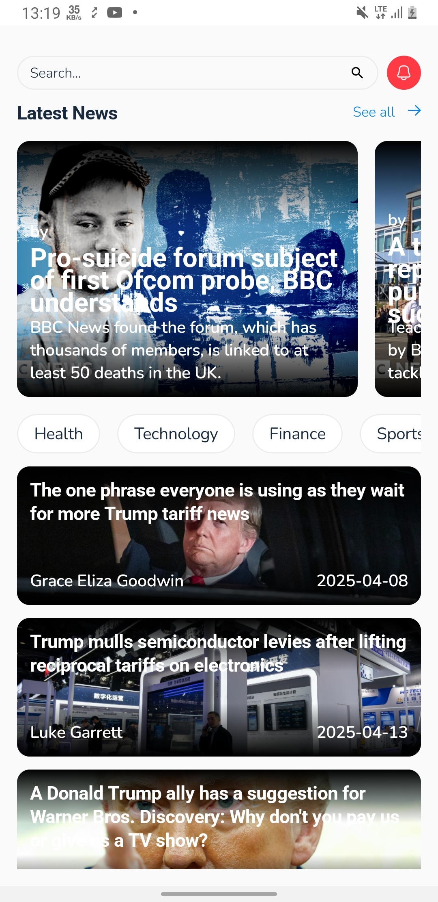
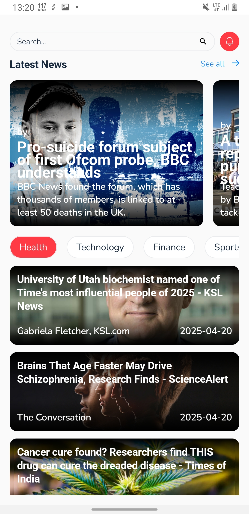
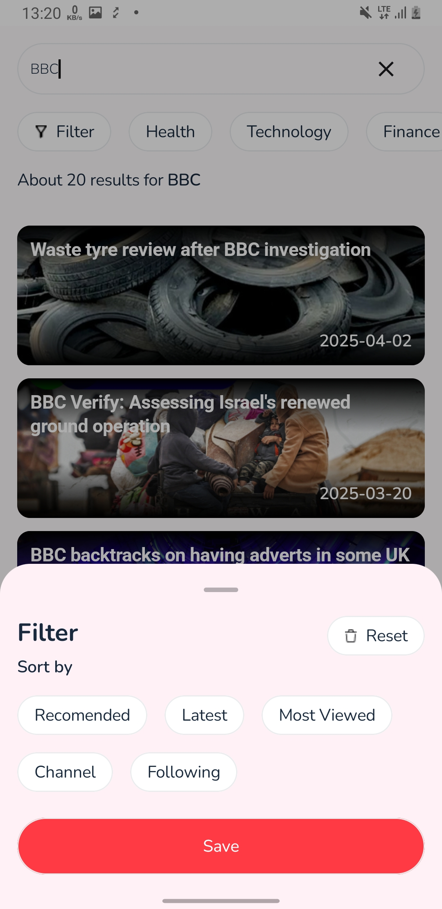
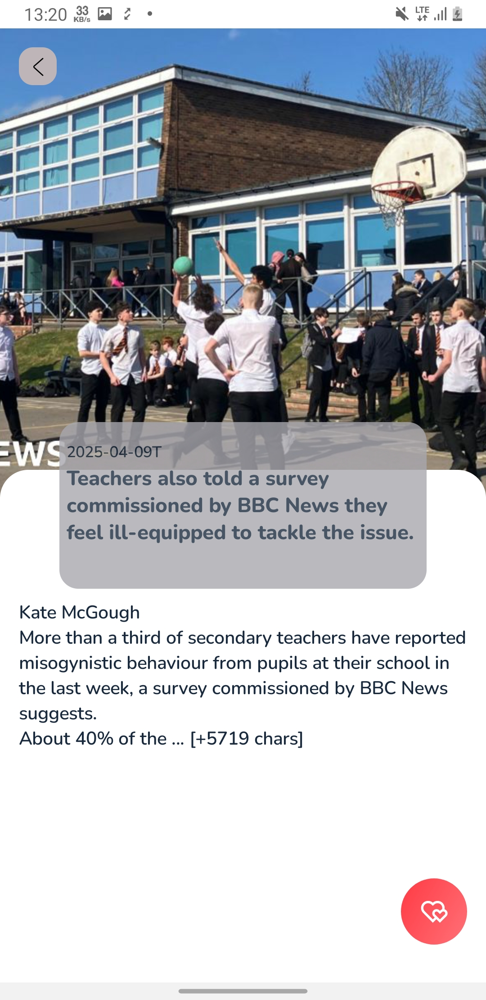

# 🗞️ News App
News App is a modern Android application that displays the latest news articles using a clean and scalable architecture. The app is built using Jetpack Compose for the UI layer, follows the MVI (Model-View-Intent) architectural pattern, uses Hilt for dependency injection, and follows a Multi-Module project structure for better separation of concerns and maintainability.

# 📌 Features
📰 Latest News – Fetch and display top headlines from a news source.

🧭 MVI Architecture – Ensures unidirectional data flow and clean separation.

💉 Hilt DI – Simplifies dependency injection across all modules.

⚙️ Multi-Module Structure – Modularized by feature, domain, and data layers.

✨ Jetpack Compose UI – Built with modern declarative UI components.

🌐 Network Integration – Easily fetch data from APIs (Retrofit or similar).

# 🛠 Technologies:

Technology	Description

Kotlin	Main programming language

Jetpack Compose	UI framework for building reactive and declarative UIs

Hilt (DI)	For managing dependencies across modules

MVI Architecture	Model-View-Intent pattern for better state management

Multi-Module	Project divided into app, domain, data, and ui

Retrofit/OkHttp	For API communication (if implemented)

Coil	For image loading (optional for news thumbnails)

Coroutines/Flow	For asynchronous and reactive data handling

#

  
  
  
  
  

# 🚀 Running the Project
Download the APK and try it out.

Author: [Hasanov Jahongir]

Contact: [jahonh959@gmail.com]
